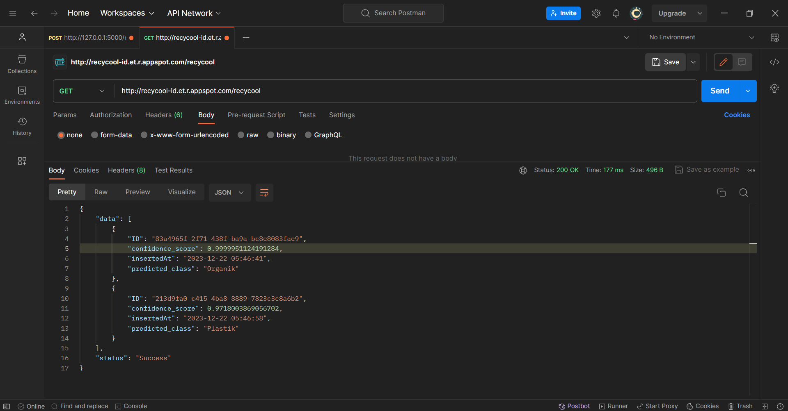
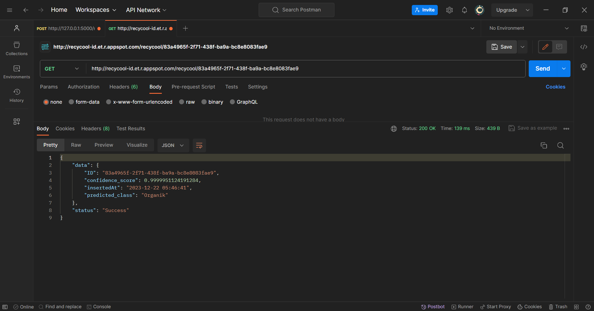
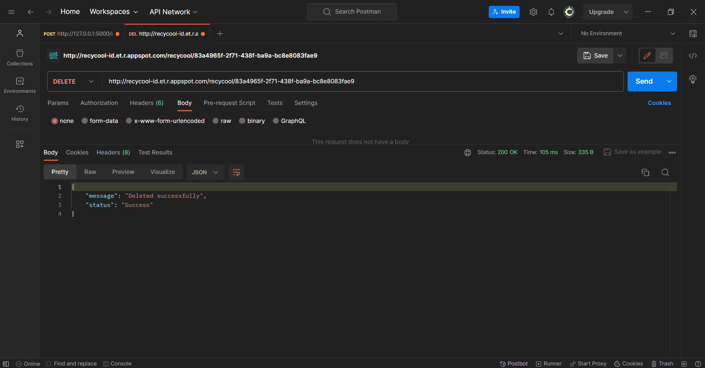

# Recycool - Flask API (build using Python 3.9.2)
Using Flask to build an API for a machine learning image classification model. This API will then be deployed using App Engine.

## How to Use

### Running API from local server

 1. Create and activate the virtual environment
  ```
 python3 -m venv env
 source env/bin/activate
 ```
 2. Install the package requirements
 ```
 pip install -r requirements.txt
 ```
 3. Run with local server
 ```
 flask run
 ```
### Deployment

Inside [Google Cloud Platform (GCP)](https://console.cloud.google.com/welcome)

#### Enable Google App Engine Admin API

 1. In the left Navigation menu, click APIs & Services > Library.
 2. Type "App Engine Admin API" in the search box.
 3. Click the App Engine Admin API card.
 4. Click Enable.

#### Deploy using App Engine

 1. Setting up region, you can find your region here https://cloud.google.com/compute/docs/regions-zones?hl=id
```
gcloud config set compute/region "REGION"
```
 2. Deploy project 
```
gcloud app deploy
```
 3. To launch the deployed browser.
```
gcloud app browse
```
then click on the link it provides.

## API Documentation

### Summary
Base URL : http://recycool-id.et.r.appspot.com/ 

Using [Postman](https://www.postman.com/) for testing APIs.

| Route | Methods | Descrition |
| --------------- | --------------- | --------------- |
| /recycool    | POST    | Submit an image and perform image classification.    |
| /recycool    | GET    | Request the submitted data.    |
| /recycool/<unique_id>    | GET    | Retrieve a specific data using a GET request.    |
| /recycool/<unique_id>    | DELETE    | Delete specific data.    |

###  Endpoints 

POST `/recycool` - Submit an image and perform image classification.

#### Request 
- **Method** : POST
- **Path** : /recycool

```json
{
    "message": "Image upload successfully",
    "status": "success"
}
```


---

GET `/recycool` - Request the submitted data.

#### Request 
- **Method** : GET
- **Path** : /recycool

```json
{
    "data": [
        {
            "ID": "5e7ba4dd-2f47-4588-8284-a2655bcf0ab8",
            "accuracy": 0.9999951124191284,
            "classification": "Organik",
            "insertedAt": "2023-12-22 13:37:08"
        }
    ],
    "status": "Success"
}
```



---

GET `/recycool/<unique_id>` - Retrieve a specific data using a GET request.

#### Request 
- **Method** : GET
- **Path** : /recycool/<unique_id>

```json
{
    "data": {
        "ID": "5e7ba4dd-2f47-4588-8284-a2655bcf0ab8",
        "accuracy": 0.9999951124191284,
        "classification": "Organik",
        "insertedAt": "2023-12-22 13:37:08"
    },
    "status": "Success"
}
```



---

DELETE `/recycool/<unique_id>` - Delete specific data.

#### Request 
- **Method** : DELETE
- **Path** : /recycool/<unique_id>

```json
{
    "message": "Deleted successfully",
    "status": "Success"
}
```


